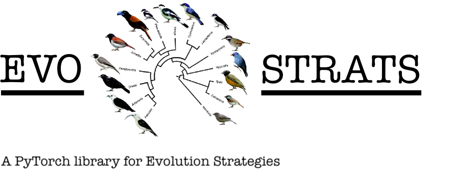
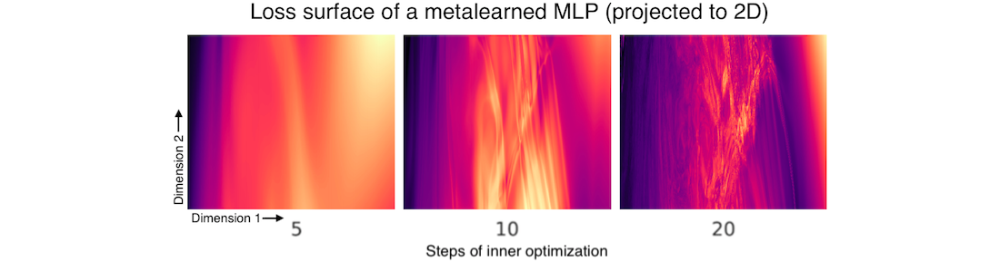
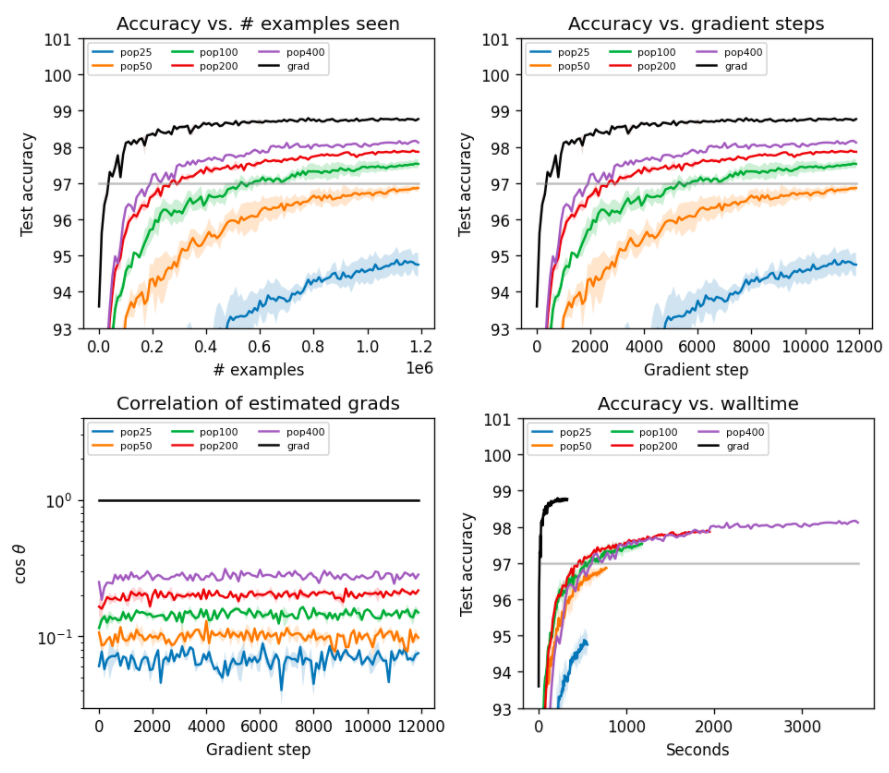

Sam Greydanus | 2020

Summary
--------
Quite a few functions are hard to optimize because they have many local minima. These functions often have "rough" loss surfaces: if you compute the analytic gradient at one point, then move a small distance away from that point and compute the gradient again, the two gradients look very different. One scenario where this happens is gradient-based metalearning (also called bilevel optimization). Here's an example from (Metz et al., 2019):

In situations like this one, it helps to smooth the loss surface, and thus the gradients, before optimization. Doing this points us towards regions of parameter space _where the overall density of good solutions_ is higher. Once we get to these regions (eg. the upper right corner of the plots above), we can anneal the smoothing factor and zero in on a particularly good solution.

Any amount of noise involved in an optimization process helps to smooth the loss surface. Stochastic gradient descent is a good example: empirical results suggest that smaller batch sizes (more stochastic gradients) can actually improve generalization in neural networks. But I agree with Metz et al. 2019 when they claim that this isn't enough to stabilize metalearning. A more extreme alternative is to use evolution strategies as a stochastic, unbiased gradient estimator ("mutation rate" ~ "smoothness factor"). Many people would say that this is crazy...

...but the purpose of this little library is to show otherwise. It consists of an ES gradient estimator and a series of benchmarks to evaluate how well it scales to high-dimensional neural network parameter spaces. Since one can never train too many MNIST classifiers, here are some results on MNIST:

The ultimate purpose of this ES gradient estimator is to optimize metalearning problems. Thus I am particularly interested in maximizing sample efficiency. After all, in metalearning, each "sample" is an entire learning process. These learning processes are extraordinarily expensive to compute.

Dependencies
--------
 * NumPy
 * SciPy
 * PyTorch